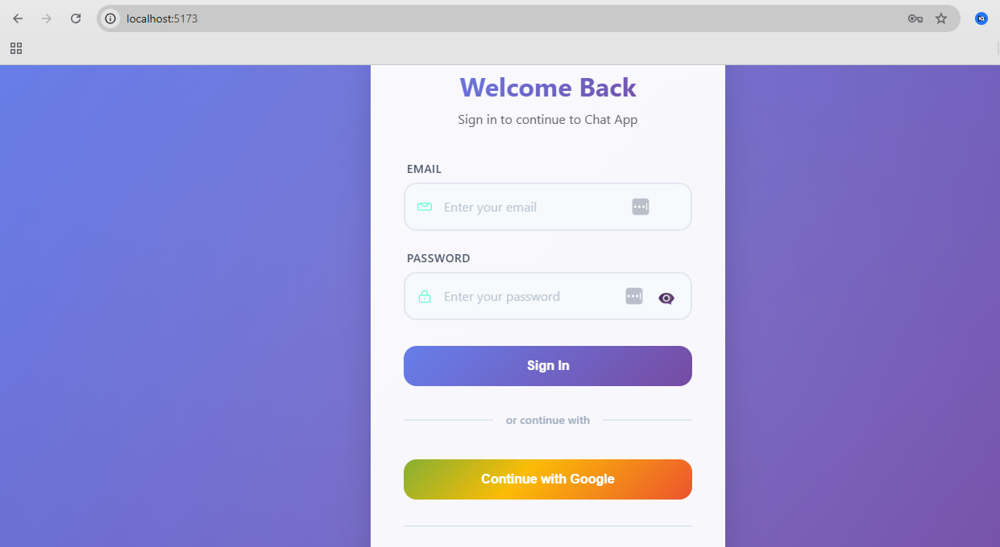
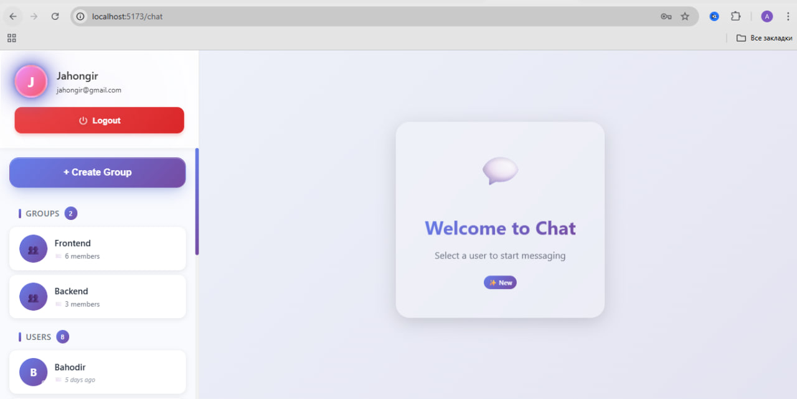
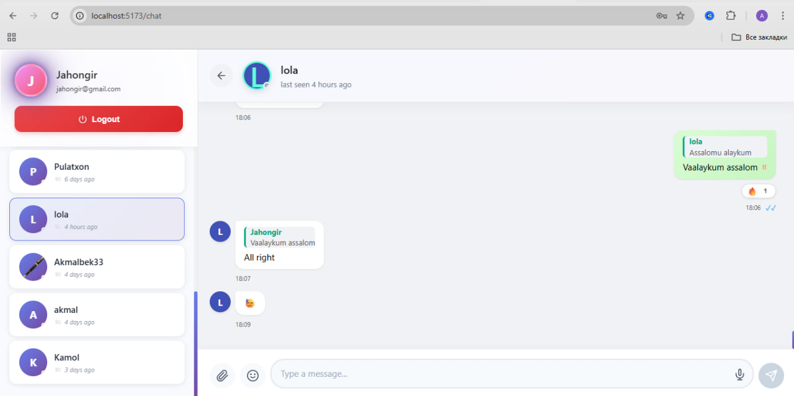
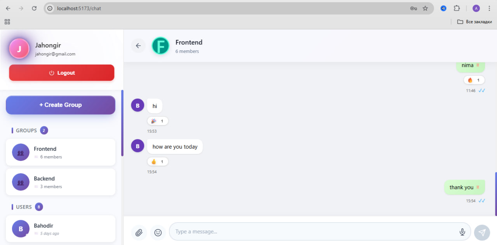

# 💬 Real-Time Chat Application

A modern real-time chat application built with **Django + Channels + React**.
Supports messaging, replies, reactions, file sharing, and real-time updates.

Supports **JWT authentication and Google OAuth login**.

---

## 🚀 Features

* ⚡ Real-time messaging (WebSocket)
* 🔐 Authentication (JWT + Google OAuth)
* ✅ Message status (sent, delivered, read)
* 💬 Reply system (Telegram-style)
* 😀 Reactions system
* 📎 File & image sharing
* 👀 Typing indicator
* 🟢 Online/offline status
* 🗑️ Edit & delete messages
* 👥 Group chat support

---

## 🛠️ Tech Stack

### Backend

* Django
* Django Channels
* Django REST Framework
* PostgreSQL
* Redis

### Frontend

* React (Vite)
* Axios
* WebSocket API

### Authentication

* JWT (SimpleJWT)
* Google OAuth 2.0

---

## 📁 Project Structure

```
chat-app/
│
├── backend/
│   ├── apps/
│   ├── config/
│   ├── manage.py
│
├── chat-frontend/
│   ├── src/
│   ├── public/
│
├── screenshots/
│   ├── login.jpg
│   ├── chat-dashboard.jpg
│   ├── private-chat.jpg
│   ├── group-chat.jpg
│
└── README.md
```

---

## ⚙️ Setup Instructions

### 1. Clone the repository

```bash
git clone https://github.com/your-username/chat-app.git
cd chat-app
```

---

### 2. Backend Setup (Django + Channels)

```bash
cd backend

python -m venv venv
venv\Scripts\activate   # Windows
# source venv/bin/activate  # Linux/Mac

pip install -r requirements.txt
```

Create `.env` file:

```
SECRET_KEY=your-secret-key
DEBUG=True

DB_NAME=your_db
DB_USER=your_user
DB_PASSWORD=your_password
DB_HOST=localhost
DB_PORT=5432
```

Apply migrations:

```bash
python manage.py migrate
```

Run backend (ASGI server with Daphne):

```bash
python -m daphne -b 127.0.0.1 -p 8000 config.asgi:application
```

---

### 3. Frontend Setup (React + Vite)

```bash
cd chat-frontend
npm install
npm run dev
```

Create `.env`:

```
VITE_API_URL=http://127.0.0.1:8000/api
VITE_GOOGLE_CLIENT_ID=your_google_client_id
```

---

## 🔄 Development Workflow

* Backend: http://127.0.0.1:8000
* Frontend: http://localhost:5173
* WebSocket: ws://127.0.0.1:8000/ws/chat/

---

## 🔐 Authentication

This project supports two authentication methods:

### 1. Email & Password

* Traditional login system using JWT

### 2. Google OAuth

* Secure login using Google account
* Implemented using Google OAuth 2.0

> ⚠️ To use Google login, you must provide your own Google Client ID in `.env`

---

## 📸 Screenshots

### 🔐 Login Page

<p align="center">
  
</p>

---

### 🏠 Chat Dashboard

<p align="center">
  
</p>

---

### 💬 Private Chat

<p align="center">
  
</p>

---

### 👥 Group Chat

<p align="center">
  
</p>

---

## 📌 Future Improvements

* 🔔 Push notifications
* 🎤 Voice messages
* 📹 Video calls
* 📱 Mobile app (React Native)

---

## 👨‍💻 Author

**Akmal Axrorov**

---

## ⭐ Support

If you like this project, give it a ⭐ on GitHub!
