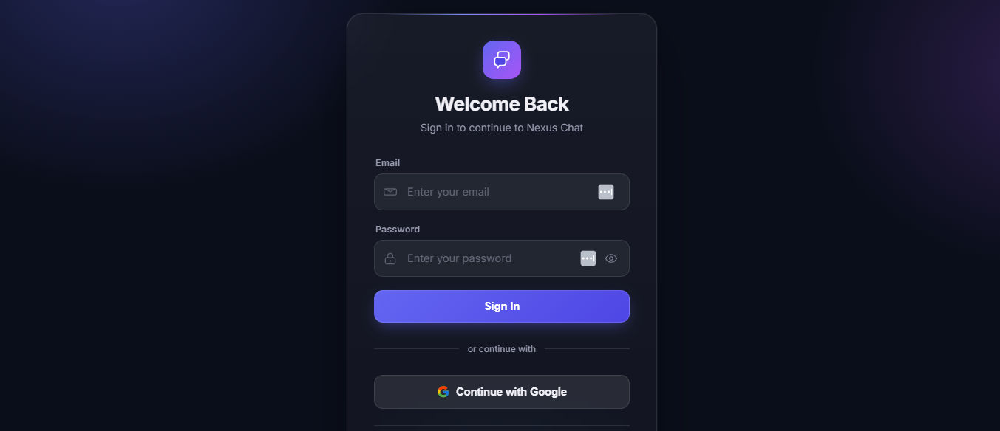
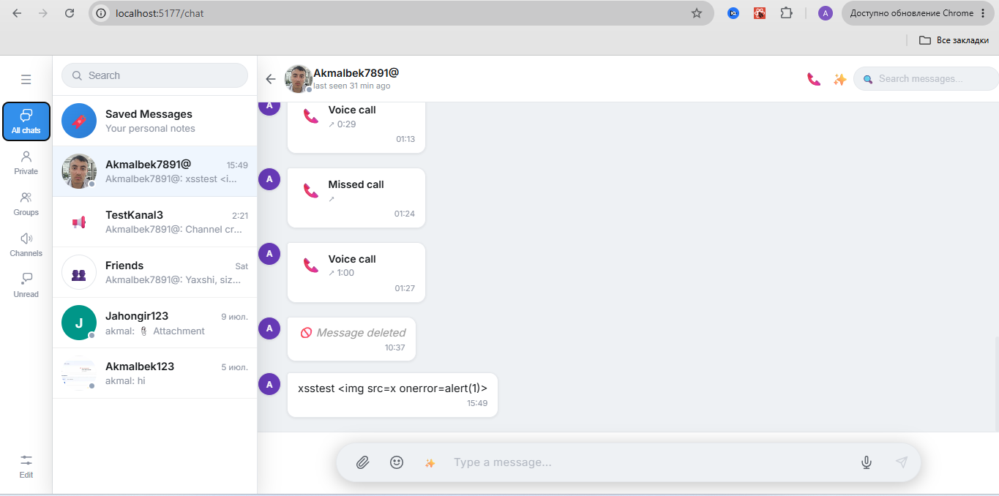
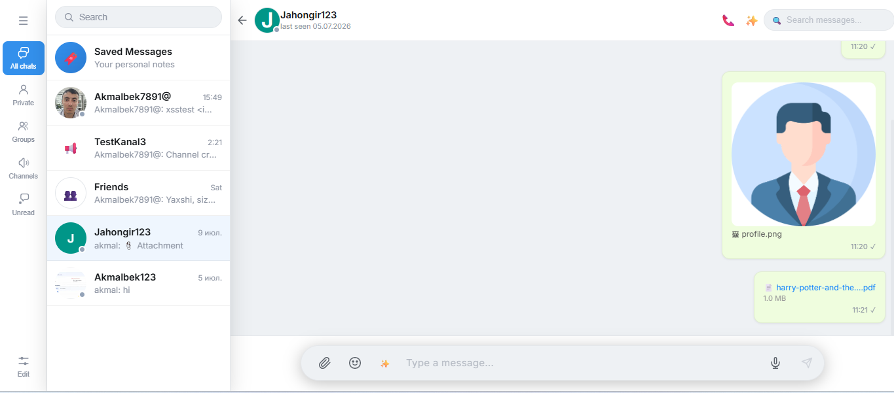
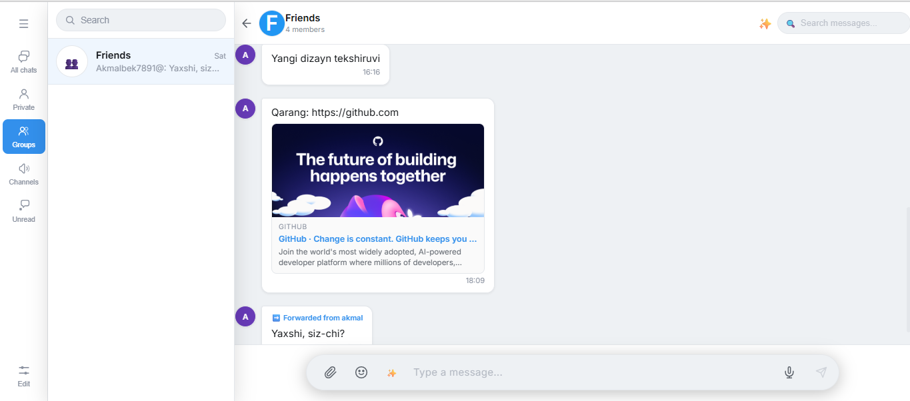
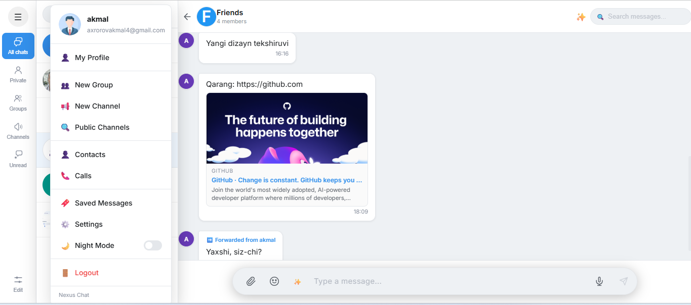

# 💬 Nexus Chat — Real-Time Chat Application

A feature-complete, real-time chat application built with **Django + Channels** on the backend and **React + Vite** on the frontend. The UI and feature set are closely modeled on **Telegram Desktop** — private chats, groups, channels, calls, folders, and a full settings/security suite — all backed by real, working logic rather than static mockups.

---

## 🚀 Features

### 💬 Messaging
* Real-time messaging over WebSocket (Django Channels)
* Message status: sent / delivered / read
* Reply system, edit & delete messages, emoji reactions, pin/unpin
* File, image, and voice message sharing with chunked/multipart upload for large files
* Link preview cards
* Rich-text formatting (**bold**, *italic*, `inline code`, auto-linked URLs) with a selection-triggered formatting toolbar
* @mention autocomplete with highlighting and a notification that bypasses mute
* Per-conversation message drafts, restored automatically when you switch back
* Per-message **AI translate** button + language preference toggle
* Full-text message search within a conversation (XSS-safe highlighting)
* **AI-powered chat search** — ask a natural-language question and get an answer grounded in that conversation's history (DeepSeek)
* **Polls** — single- or multiple-choice, quiz mode with a post-vote correct-answer reveal, anonymous voting, participant-added options, revoting on/off, shuffled option order, and time-limited polls, all synced live over WebSocket
* Auto-delete messages after a configurable interval (Celery Beat periodic task)
* Export chat history as a downloadable, self-contained `.zip` (HTML transcript + real photos/videos/files/voice folders) or plain `.txt`, with content-type, size-limit, and date-range filters
* Desktop, sound & **Web Push** notifications (delivered via a Service Worker even when the tab/app is closed), typing indicator, online/offline presence

### 👥 Groups & Channels
* Group creation with a real member-management panel (mute, add members, manage, leave — admin-gated)
* Channel creation, editing (name/avatar/description/public-private/invite link) restricted to admins/owner
* Public channel discovery — search and join open channels
* Custom folders — create, delete, and assign chats/channels to a folder
* Chat header quick-actions menu — mute/unmute, view group/channel info, manage (admin-gated), create a poll, export chat history, report the chat to moderators, clear your own local history, leave

### 📞 Calls
* 1:1 audio & video calls over WebRTC
* **coturn** TURN relay server for reliable connectivity behind strict NAT/corporate networks (STUN alone isn't enough)
* Global call history across all conversations, grouped by contact, with one-tap redial
* "New Call" screen to dial any contact directly

### 🔐 Security & Privacy
* JWT authentication (SimpleJWT) + Google OAuth 2.0
* **Two-Step Verification (2FA)** — password, hint, and recovery email, matching Telegram's exact flow
* **Active Sessions** — real per-device session list with instant, server-side token revocation (REST *and* WebSocket)
* **Local Passcode** — client-side 4-digit PIN app lock (SHA-256, never leaves the device)
* Real user blocking, enforced server-side on both conversation creation and message send
* Antivirus scanning of every uploaded file via **ClamAV** (fails closed if the scanner is unreachable)
* Rate limiting (DRF throttling) on login, 2FA verification, messaging, and uploads
* `DEBUG` and `ALLOWED_HOSTS` are environment-driven, not hardcoded, so a misconfigured deploy can't accidentally ship debug mode
* Server-enforced total upload size cap (`MAX_UPLOAD_SIZE_MB`), independent of any client-side check
* Postgres, Redis, MinIO console, and ClamAV ports are bound to `127.0.0.1` in Docker Compose — never exposed on the host network
* Optional **Sentry** error monitoring on both backend and frontend (silently disabled when no DSN is configured)

### 🤖 AI (DeepSeek)
* Conversation summarization
* Smart reply suggestions
* Per-message translation
* Grammar correction

### 📲 Progressive Web App
* Installable on desktop and mobile (manifest + Service Worker) — runs like a native app, outside the browser chrome
* Background Web Push delivery survives a closed tab; the Service Worker suppresses duplicate notifications while the chat is already focused

### 🎨 Customization
* Four themes — Classic, Day, Tinted, Night — each with a genuinely distinct color palette
* Custom accent color picker
* Auto-night mode (follows the OS light/dark preference)
* Real-time UI language switching (English / Russian), applied instantly across the whole app without a reload

---

## 🛠️ Tech Stack

### Backend
* Django 5 + Django REST Framework
* Django Channels (ASGI, served via **daphne**)
* PostgreSQL
* Redis (Channels layer + Celery broker)
* Celery + Celery Beat (background & periodic tasks)

### Frontend
* React 18 + Vite
* Axios, native WebSocket API
* WebRTC (`RTCPeerConnection`)

### Infrastructure
* Docker & Docker Compose
* MinIO — S3-compatible object storage (chunked multipart upload)
* ClamAV — antivirus scanning
* **coturn** — STUN/TURN server for WebRTC

### Authentication & AI
* JWT (SimpleJWT) with custom session-aware revocation
* Google OAuth 2.0
* DeepSeek API (AI features, including AI-powered chat search)

### Notifications & Monitoring
* Web Push (`pywebpush`, VAPID) delivered through a Service Worker
* Sentry (optional, DSN-gated) for backend and frontend error monitoring

---

## 🧠 Architecture Overview

```
 React (Vite)  ──REST API / WebSocket──▶  Django + Channels (daphne)
                                                 │
                     ┌───────────────────────────┼────────────────────────────┐
                     ▼               ▼            ▼             ▼             ▼
               PostgreSQL         Redis         MinIO         ClamAV       coturn
              (data store)   (Channels layer,  (S3 file      (virus       (WebRTC
                              Celery broker)     storage)      scan)      TURN relay)
```

* Django REST Framework handles all business-logic HTTP endpoints
* Django Channels manages WebSocket connections (chat, calls, notifications)
* Redis backs both the Channels layer and the Celery task queue
* Celery + Celery Beat run background jobs — virus scanning, auto-delete of expired messages
* MinIO stores all uploaded files; ClamAV scans each one before it's served
* coturn provides a real relay path for calls when a direct/STUN connection isn't possible

---

## 📁 Project Structure

```
chat-app/
│
├── backend/
│   ├── apps/
│   │   ├── users/           # accounts, JWT auth, 2FA, sessions, blocking
│   │   ├── conversations/    # private/group/channel chats, membership, folders
│   │   ├── messaging/        # messages, attachments, reactions, calls, WebSocket consumer
│   │   ├── notifications/    # push/desktop notification delivery
│   │   └── ai/                # DeepSeek-backed summarize/translate/suggest/grammar
│   ├── utils/                 # MinIO, ClamAV, link preview helpers
│   ├── config/                 # settings, asgi/wsgi, celery, root routing
│   ├── docker-compose.yml
│   └── manage.py
│
├── chat-frontend/
│   ├── src/
│   │   ├── components/        # one component per feature/screen (57+)
│   │   ├── context/            # ChatsContext, CallContext, OnlineUsersContext
│   │   ├── pages/               # Login, Register, Chat
│   │   ├── utils/                # i18n, theme, localPasscode, formatTime, ...
│   │   └── styles/                # global stylesheets
│   └── public/
│
├── screenshots/
└── README.md
```

---

## ⚙️ Setup Instructions

### 🐳 Run with Docker (recommended)

This is the way the project is actually developed and run — a single command brings up every service (backend, frontend, PostgreSQL, Redis, MinIO, ClamAV, Celery, Celery Beat, and coturn).

```bash
git clone https://github.com/your-username/chat-app.git
cd chat-app/backend

# create backend/.env — see "Environment Variables" below
docker compose up --build
```

| Service | URL |
|---|---|
| Frontend | http://localhost:5177 |
| Backend API | http://localhost:8004/api |
| WebSocket | ws://localhost:8004/ws/ |
| MinIO console | http://localhost:9005 |

> Django's ASGI server (**daphne**) does not auto-reload — restart the `backend` container after backend code changes: `docker compose restart backend`.

### 🔧 Manual setup (without Docker)

**Backend**

```bash
cd backend
python -m venv venv
venv\Scripts\activate        # Windows
# source venv/bin/activate   # Linux/Mac

pip install -r requirements.txt
python manage.py migrate
python -m daphne -b 127.0.0.1 -p 8000 config.asgi:application
```

You'll also need PostgreSQL, Redis, MinIO, and (optionally) a coturn instance running and reachable at the addresses configured in `.env`.

**Frontend**

```bash
cd chat-frontend
npm install
npm run dev
```

---

## 🔑 Environment Variables

**`backend/.env`**

```env
SECRET_KEY=your-secret-key
DEBUG=True

DB_NAME=chatdb
DB_USER=postgres
DB_PASSWORD=your_password
DB_HOST=db
DB_PORT=5432

GOOGLE_CLIENT_ID=your_google_client_id
GOOGLE_SECRET_KEY=your_google_client_secret

MINIO_ACCESS_KEY=minioadmin
MINIO_SECRET_KEY=minioadmin
MINIO_BUCKET_NAME=chatapp
MINIO_ENDPOINT=http://minio:9000
MINIO_REGION=us-east-1

DEEPSEEK_API_KEY=your_deepseek_api_key

# coturn (WebRTC TURN relay)
TURN_REALM=chatapp.local
TURN_USERNAME=chatuser
TURN_PASSWORD=your_turn_password
TURN_EXTERNAL_IP=127.0.0.1

# admin account, created automatically on first boot
DJANGO_SUPERUSER_USERNAME=admin
DJANGO_SUPERUSER_EMAIL=admin@example.com
DJANGO_SUPERUSER_PASSWORD=a-strong-password
```

**`chat-frontend/.env`**

```env
VITE_API_URL=http://localhost:8004/api
VITE_WS_URL=ws://localhost:8004
VITE_GOOGLE_CLIENT_ID=your_google_client_id

VITE_TURN_URL=turn:localhost:3478
VITE_TURN_USERNAME=chatuser
VITE_TURN_PASSWORD=your_turn_password
```

> `.env` files are gitignored on both sides — never commit real secrets. Vite only reads `.env` at server boot, so restart the `frontend` container after changing it.

---

## 🔐 Authentication

* **Email & password** — JWT-based login (SimpleJWT)
* **Google OAuth 2.0** — one-click sign-in (requires your own `GOOGLE_CLIENT_ID`)
* **Two-Step Verification** — an optional second factor (password + hint + recovery email) enforced at login before a token is issued

---

## 🛡️ Security

* Every uploaded file is scanned by a real **ClamAV** instance before it's servable; if the scanner itself is unreachable, the file is treated as unsafe rather than silently allowed through
* Passwords and the 2FA secret are hashed with Django's `make_password`/`check_password` — never stored in plain text
* JWT sessions are individually revocable — terminating a session in **Active Sessions** invalidates that token immediately for both REST requests and open WebSocket connections
* Message search results are HTML-escaped before rendering, closing off stored-content XSS via the search UI
* Rate limiting (DRF throttling) on login, 2FA verification, messaging, and file uploads
* CORS restricted to an explicit allow-list, never a wildcard
* All ORM-only data access — no raw SQL, no SQL-injection surface
* Secrets (`SECRET_KEY`, DB/MinIO/DeepSeek credentials) are read exclusively from environment variables and are never committed to the repository

---

## 📸 Screenshots

### 🔐 Login Page

<p align="center">
  
</p>

---

### 🏠 Chat Dashboard

<p align="center">
  
</p>

---

### 💬 Private Chat

<p align="center">
  
</p>

---

### 👥 Group Chat

<p align="center">
  
</p>

---

### 💬 Rich Messaging & Menu

<p align="center">
  
</p>

---

## ⚡ Highlights

* Production-shaped, service-oriented architecture (Docker Compose across 9 services)
* Real-time messaging and calls with a genuine NAT-traversal fallback (TURN), not STUN-only
* Secure file pipeline: chunked upload → MinIO storage → ClamAV scan
* A settings and security suite (2FA, sessions, blocking, local passcode) built to match Telegram's actual behavior, not a placeholder UI
* Instant, real UI language switching with no page reload

---

## 📌 Roadmap

* 🎙️ Voice-message-to-text transcription (blocked on a paid STT API key — DeepSeek doesn't support audio)
* 👥 Group video calls (currently 1:1 only — needs a mesh/SFU architecture)
* 🛡️ Full admin moderation console (a banned-word filter, plus a review UI for the reports the app already collects)
* 📱 Native mobile app (React Native)
* 🌍 Additional UI languages beyond English/Russian

> Telegram Premium/Stories-tier features (Live streams, Boosts, Story Archive, Send a Gift, custom fonts) are intentionally out of scope for a self-hosted chat app.

---

## 👨‍💻 Author

**Akmal Axrorov**

---

## ⭐ Support

If you like this project, give it a ⭐ on GitHub!
